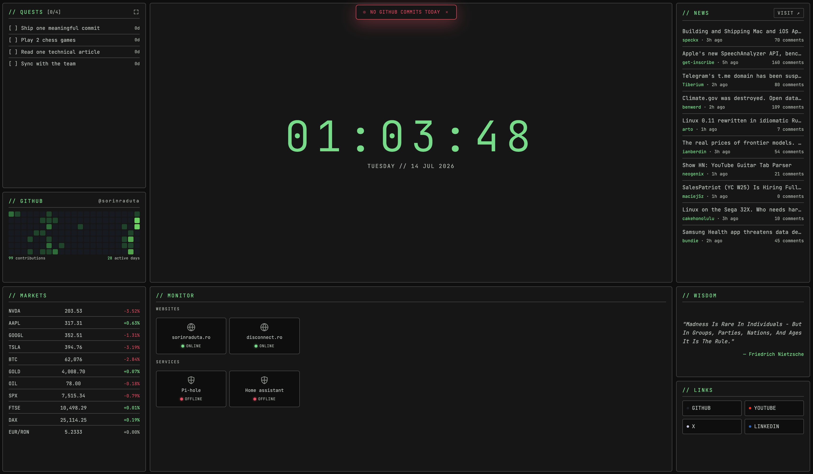
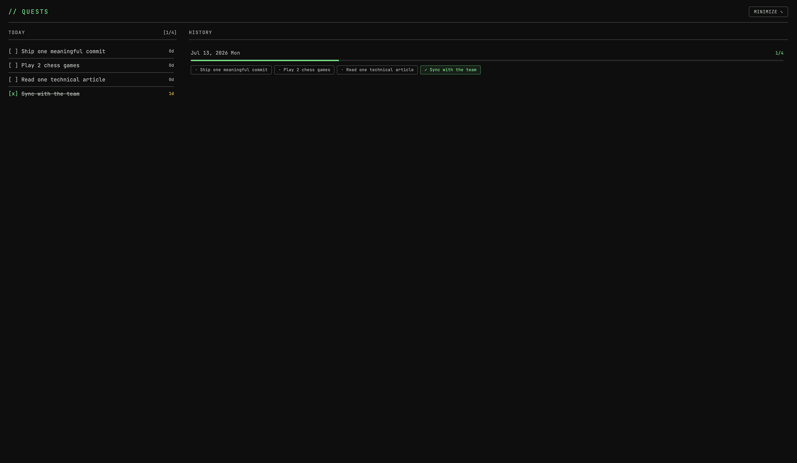
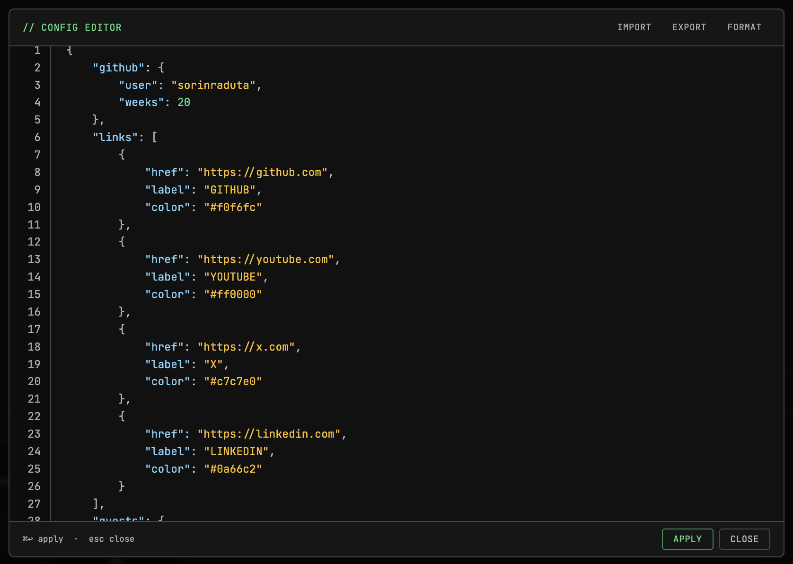

# Dashboard — New Tab

A personal, terminal-styled new-tab dashboard for Chrome. Replaces the browser's
new-tab page with an at-a-glance grid of daily quests, a clock, your GitHub
contribution graph, live markets, uptime monitors, Hacker News, and more — all
in a monospace, green-on-black aesthetic.

Built with vanilla JavaScript and [lit-html](https://lit.dev/) — no build step,
no framework, no bundler.



## Features

- **Quests** — daily to-dos that reset at a configurable hour, with per-task
  streak tracking (checking a task earns a day; unchecking reverts it). Drag to
  reorder. Press **`q`** to open a fullscreen view with completion history.
- **Clock** — large live clock with the current weekday and date.
- **GitHub** — a contribution heatmap for your username, plus a floating alert
  when you have **no commits today**.
- **Markets** — live quotes for stocks, indices, crypto, commodities, and FX
  (Yahoo Finance, CoinGecko, Frankfurter). Drag to reorder.
- **Monitor** — up/down status for your websites and self-hosted services.
- **News** — top stories from Hacker News. Press **`n`** to open HN.
- **Wisdom** — a random quote each load; click the author to search DuckDuckGo.
- **Links** — a quick-launch grid of your favorite sites.

### Quests, expanded

Press **`q`** (or click the maximize icon on the QUESTS panel) for a fullscreen
view showing today's tasks alongside your day-by-day history. Press **`esc`** to
minimize.



### Config editor

Press **`c`** to open an in-app JSON editor for every section — tasks, links,
markets, monitors, and more. Edit live, **format**, and **import/export** the
whole config as a JSON file. Changes are saved to `localStorage`.



## Keyboard shortcuts

| Key   | Action                          |
| ----- | ------------------------------- |
| `c`   | Open the config editor          |
| `q`   | Maximize quests (tasks + history) |
| `n`   | Open Hacker News                |
| `esc` | Close the current overlay       |

Shortcuts are ignored while typing in a text field.

## Install (as a Chrome extension)

1. Copy the example config and customize it:

   ```bash
   cp src/config.example.js src/config.js
   ```

   (`src/config.js` is git-ignored.)
2. Open `chrome://extensions`, enable **Developer mode**.
3. Click **Load unpacked** and select this project's root folder.
4. Open a new tab.

To apply manifest changes later, hit the reload icon on the extension card.

## Local development

The project runs as-is from the filesystem, but a small dev server is included
that also proxies CORS-less APIs (e.g. Yahoo Finance) during development:

```bash
npm run dev
```

Then open <http://localhost:8787>. In the installed extension, those same
requests are routed through a background service worker instead, so they work
without the proxy.

## Configuration

`src/config.js` is **git-ignored** — copy from `src/config.example.js` and edit:

```bash
cp src/config.example.js src/config.js
```

Example shape:

```js
export default {
    github: { user: "your-handle", weeks: 20 },
    links: [
        { href: "https://github.com", label: "GITHUB", color: "#f0f6fc" },
    ],
    quests: {
        resetHour: 3,
        resetMinute: 0,
        items: [
            { label: "Ship one meaningful commit" },
            { label: "Read one technical article" },
        ],
    },
    markets: [
        { label: "NVDA", ticker: "NVDA", url: "https://finance.yahoo.com/quote/NVDA" },
        { label: "BTC",  ticker: null,   url: "https://www.coingecko.com/en/coins/bitcoin" },
    ],
    monitor: {
        websites: [
            { name: "example.com", url: "https://example.com", check: "https://example.com", icon: "web" },
        ],
        local: [
            { name: "Pi-hole", url: "http://pi.hole/admin", check: "http://pi.hole/admin", icon: "pihole" },
        ],
    },
};
```

Everything here can also be edited at runtime via the config editor (**`c`**),
which persists to `localStorage` and takes precedence over `config.js`.


## Tech

Vanilla JS · lit-html · Chrome Extension Manifest V3 · no build step.
